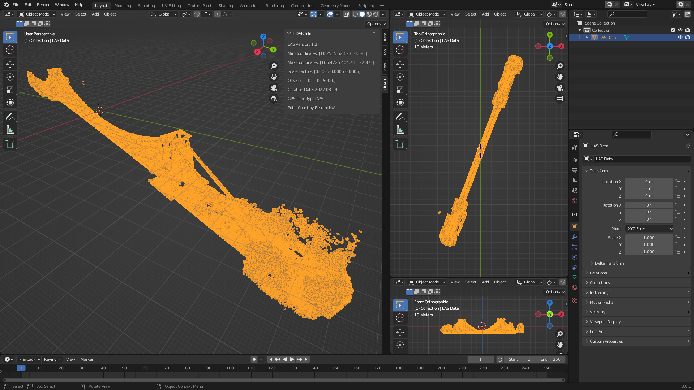

>***Warning***
>This plugin was initialy written in 2014 during my college days for a Boeing competition.  It may not be compatible with the latest version of Blender.  I've been receiveing a lot interest in getting the plugin to work, so I will look into what I can do, but I can't make any promises.  I've made some recent changes that seem to be working ok, but the code needs some major updates to really be usable.

Blender LiDAR Importer
==============
This is a Blender LiDAR Importer I built for importing LASer (LAS) point cloud data sets.  This addon currently ONLY supports the LAS file format.

## Install Instructions:
1. First, you'll need to install laspy[lazrs]. Open Blender, go to the Scripting workspace, and in the Interactive Console type:
```
import sys; sys.executable
```
This will tell you where the python interpreter is that Blender is using.  For example: '/usr/bin/python3.10'

Now, open a Terminal and install laspy by replacing the path to the interpreter to the one you just discovered above:

Linux:
```
/replace/with/path/to/python -m pip install laspy[lazrs]
```
Note: You may need to use sudo on Linux if your OS requires it.

Windows (replace the path with the correct version):
```
"C:\Program Files\Blender Foundation\Blender x.x\x.x\python\bin\python.exe" -m pip install laspy[lazrs]
```

2. Next, Clone this GitHub Repository to your local machine:
```
git clone https://github.com/nittanygeek/LiDAR-Importer.git
```

3. In Blender, Navigate to Edit > Preferences, and click on Add-ons tab.  Click "Install" at the top, and Select the \__init__.py file from cloned repository.  Finally, Activate the Addon.

## Usage:
File > Import > LiDAR Format (.las) > Select your LAS file and click "Import LiDAR File"
**Note: Large LAS files will take a long time to import.  Be patient.**


## License:
This code is available under the MIT License (see [LICENSE.txt](LICENSE.txt) for more information)
